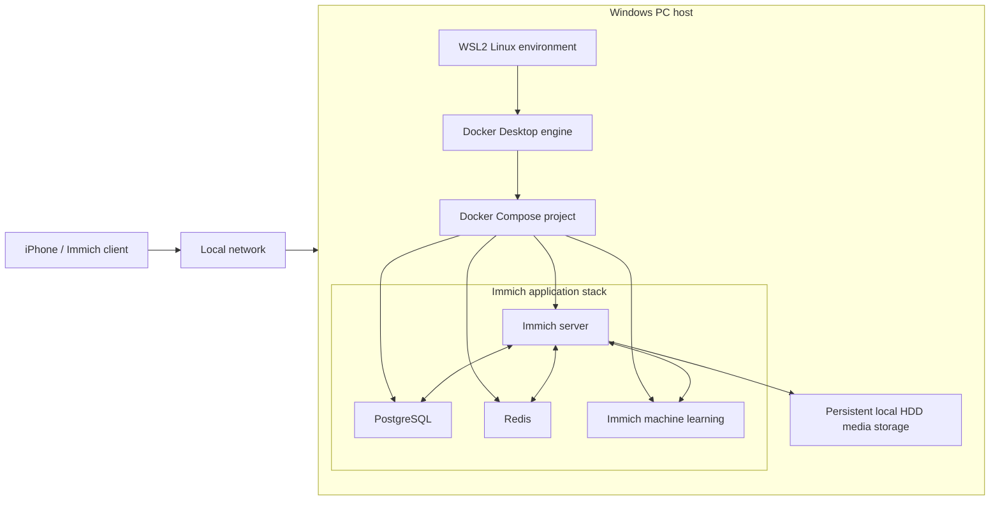
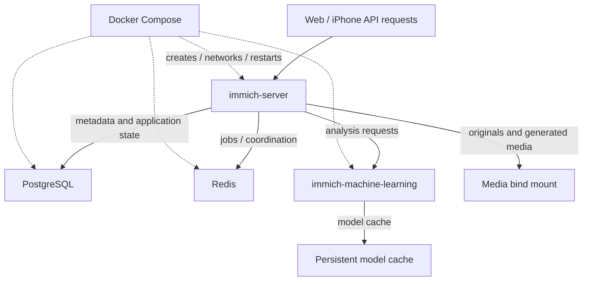
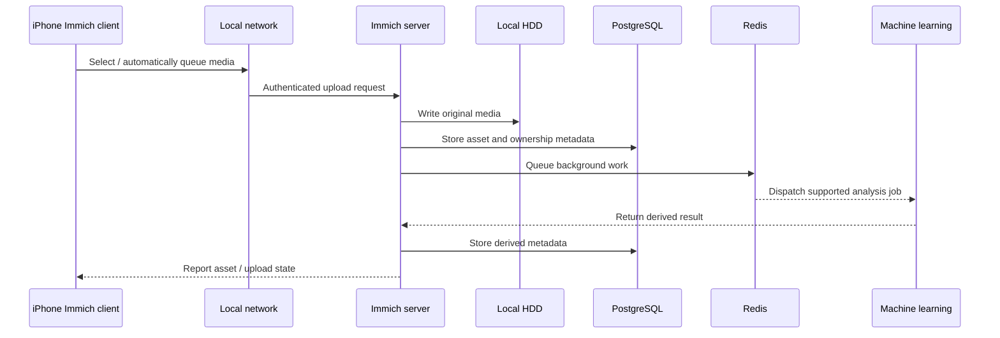
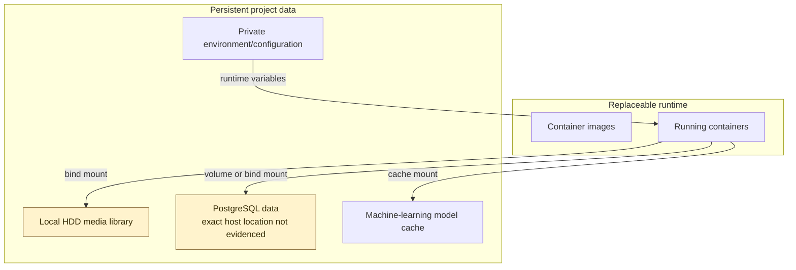
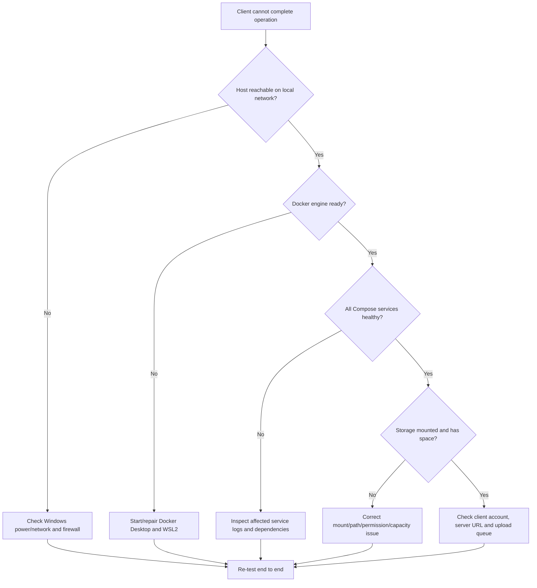
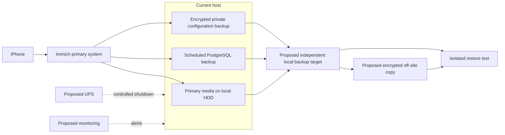

# Personal Cloud / Homelab

A practical self-hosting case study built to learn how a personal photo service moves from infrastructure planning to an operational multi-container application. The verified historical deployment used a Windows PC, WSL2, Docker Desktop, Docker Compose, Immich, PostgreSQL, Redis, Immich machine learning, an iPhone client and persistent local-HDD media storage.

> **Evidence boundary:** the project owner confirmed that this stack successfully operated. During the repository audit, the current Windows installation reported no installed WSL distribution and exposed no Docker command, so live container state and power/restart recovery could not be re-tested. This repository does not claim those unverified results.

## Development Story

**Problem / Motivation → Infrastructure Planning → Host Environment → WSL2 → Docker Deployment → Service Architecture → Persistent Storage → Mobile Client → Data Flow → Testing → Troubleshooting → Operational System → Current Limitations → Future Improvements**

## Project Overview

The project explores a local, self-hosted alternative for managing an iPhone photo library. Immich provides the client and web application; PostgreSQL stores application metadata; Redis supports asynchronous work; and the machine-learning service performs media-analysis tasks. Docker Compose defines and coordinates the services on a Windows host using Docker Desktop's WSL2-based Linux environment.

This is a technical learning project, not a production cloud service and not a complete backup system.

## Problem and Motivation

The goal was to understand the infrastructure behind a personal photo service rather than only install an application. The work required decisions about the host, Linux/container boundary, dependent services, persistent data, local-network clients, restart procedures and the difference between primary storage and backup.

## Learning Objectives

- Run a multi-container application with Docker Compose.
- Understand service dependencies between an application, database, cache/queue and machine-learning worker.
- Map container data to persistent host storage.
- Connect a mobile client over the local network.
- Observe start-up, status, logs and failure states.
- Treat recovery, credentials and backup as infrastructure concerns.
- Document what is implemented separately from future ideas.

## Implemented vs Planned

| Implemented / historically operational | Planned or not verified |
| --- | --- |
| Windows PC host | Independent secondary backup target |
| WSL2-based container environment | Off-site/encrypted backup copy |
| Docker Desktop and Docker Compose | UPS protection |
| Immich server | Monitoring and alerting |
| PostgreSQL | Secure remote access |
| Redis | Automated, tested restore workflow |
| Immich machine-learning service | Jellyfin or Nextcloud deployment |
| iPhone Immich client on the network | Formal service-level objectives |
| Media stored on one local HDD | Automated integrity checks |

Jellyfin, Nextcloud, extra drives, UPS protection, monitoring and remote-access services are **not presented as implemented**.

## 1. Overall Homelab Architecture



## Infrastructure Planning

The design divided the system into four concerns:

1. **Client access:** an iPhone connects to Immich across the network.
2. **Compute:** the Windows PC supplies CPU, memory and the container runtime.
3. **Services:** Compose creates an application stack with explicit service roles.
4. **Persistence:** media must survive container replacement and therefore lives outside a container's writable layer.

The local HDD provides persistent primary storage, but it is a single failure domain. Persistence protects against container recreation; it does not provide independent redundancy.

## Host Environment

### Windows Host

Windows is the physical host and lifecycle boundary. If the PC is shut down, sleeps or loses power, all containers become unavailable to the iPhone. Windows also owns the local disk and the Docker Desktop application lifecycle.

### WSL2

WSL2 supplied the Linux environment used by Docker Desktop for Linux containers. It sits between the Windows host and the container workloads; it is not an additional backup layer. WSL paths, Windows paths and Docker mounts have different ownership/performance characteristics, so path selection is part of the infrastructure design.

### Docker Desktop and Compose

Docker Desktop provided the container engine. Docker Compose described the service set, networks, environment values and persistent mounts as one application. The original private configuration is not published. [`docker-compose.example.yml`](docker-compose.example.yml) and [`.env.example`](.env.example) are sanitized architecture examples with placeholders, not a claim of the exact original version or paths.

## 2. Docker Service Architecture



### Service Responsibilities

| Service | Responsibility | Persistence concern |
| --- | --- | --- |
| Immich server | API, web application and media workflow | Media location must be mapped outside the container |
| PostgreSQL | Users, asset metadata and application records | Database data requires persistent storage and backup |
| Redis | Short-lived coordination and background work support | Not a substitute for PostgreSQL or media backup |
| Machine learning | Media-analysis jobs such as search-related processing | Model cache can reduce repeated downloads/work |

The services form one application. A running server container is not sufficient if its database or required dependencies are unavailable.

## Persistent Storage

Container images and writable container layers are replaceable. Persistent data must be mounted from a durable host location or managed volume. The verified project record identifies local-HDD media storage; it does not establish a second independent copy.

## 3. Mobile Photo Upload and Data Flow



Network availability determines whether the phone can reach the server, but the final durable state spans both media files and PostgreSQL metadata. A useful recovery strategy must protect both.

## 4. Storage Architecture



The yellow data sets are operationally critical. Storing them on one local HDD gives persistence, not redundancy. Disk failure, accidental deletion, corruption, theft or host damage could affect the only copy.

## Mobile Client Workflow

1. The iPhone joins a network that can reach the Windows host.
2. The Immich client authenticates to the server using a privately configured server address and account.
3. The client submits selected or configured photo uploads.
4. Immich stores media and application metadata, then schedules background processing.
5. The client reflects server-side asset state after processing.

Private IP addresses, account details and tokens are intentionally omitted.

## Testing and Verification

### Verified

- The project owner reports that the Immich services operated through Docker containers.
- The implemented service set is Windows, WSL2, Docker Desktop/Compose, Immich server, PostgreSQL, Redis and Immich machine learning.
- An iPhone Immich client was used.
- Media used persistent local-HDD storage.

### Current Audit Result

On the audit date, Windows reported no installed WSL distribution and the Docker command was unavailable. Therefore, the repository does not claim a currently running stack, active container health, a specific Immich version or successful recovery after the present host's restart/power interruption.

### Test Matrix for the Next Rebuild

| Test | Procedure | Evidence to record |
| --- | --- | --- |
| Service health | Start Compose and inspect all services | Container states and sanitized health output |
| Mobile upload | Upload a non-sensitive test image | Client completion, server asset and disk file |
| Metadata dependency | Stop/restart PostgreSQL in a maintenance window | Server behavior and recovery time |
| Worker dependency | Observe a background job through Redis/ML | Sanitized logs and completed job |
| Container recreation | Recreate server container | Media and metadata remain available |
| Docker restart | Restart Docker Desktop | Which services return automatically and elapsed time |
| Host restart | Reboot Windows under controlled conditions | Docker/Compose startup and client availability |
| Power interruption | Only with a safe test plan | Filesystem/database checks and recovery outcome |
| Backup restore | Restore into an isolated location | Media count, database consistency and spot checks |

Expected results are not recorded as passed results until the test is actually performed.

## Startup, Shutdown and Recovery

### Normal Start

1. Start Windows and Docker Desktop.
2. Confirm the container engine is ready.
3. From the private deployment directory, start the Compose project.
4. Check service state and sanitized logs.
5. Confirm the Immich interface is reachable on the local network.
6. Upload a non-sensitive test asset if end-to-end validation is needed.

### Planned Controlled Shutdown

1. Allow active uploads/background jobs to finish where practical.
2. Stop the Compose project cleanly.
3. Exit Docker Desktop before planned host maintenance if required.
4. Shut down Windows normally.

### Verified Recovery Boundary

Compose can define restart policies, but the original private file and a dated recovery test are unavailable. This repository therefore **does not claim automatic recovery** after host shutdown, Docker restart or power loss. [`docs/OPERATIONS.md`](docs/OPERATIONS.md) provides the commands and evidence checklist for a future verification run.

## Basic Maintenance

- Check free space on the media and database locations.
- Review container state and logs without publishing private addresses or tokens.
- Read the release notes before updating Immich and its database dependencies.
- Back up the database and media as a coordinated set before upgrades.
- Test restoration separately from the primary host.
- Review `.env` and Compose changes for secrets before committing.

## Troubleshooting Approach



Troubleshoot from the outer dependency inward: host and network, container engine, Compose services, storage and finally the client. Preserve logs before restarting when they may explain the failure.

## Engineering Challenges and Lessons Learned

No detailed incident log was supplied, so this section contains only issues verified during the portfolio audit.

| Verified issue or constraint | Lesson |
| --- | --- |
| The previously operational environment is not reproducible on the current Windows state because no WSL distribution/Docker command is available | Infrastructure documentation and sanitized configuration should be version-controlled while the system is working |
| Media exists on one local HDD without an evidenced independent copy | Persistent storage and backup solve different problems |
| A complete Immich asset depends on both files and database metadata | Recovery planning must protect related data consistently |
| The original private Compose/environment files cannot be published | Public examples need placeholders and a deliberate secret-handling workflow |
| Shutdown, Docker restart and power-interruption results were not recorded | Recovery behavior should be tested and timed, not inferred from restart-policy syntax |

The project nevertheless provided practical exposure to containerization, multi-container applications, persistent storage, databases, service dependencies, self-hosting, system recovery concepts, troubleshooting and basic infrastructure planning. These are hands-on learning outcomes, not expert-level claims.

## Security Considerations

- Never commit the real `.env` file, database password, Immich credentials, API keys, private IP addresses or filesystem locations that reveal private information.
- Keep private deployment configuration outside the public repository and use restrictive filesystem permissions.
- Treat screenshots and logs as data exports: inspect them for names, faces, email addresses, tokens, internal addresses and paths before publication.
- Do not expose Immich directly to the public Internet without a reviewed authentication, TLS, patching, firewall and reverse-proxy/remote-access design.
- External exposure increases risks from software vulnerabilities, credential attacks, misconfiguration and data leakage.
- Use unique credentials, rotate exposed secrets and keep the host and container images patched.
- Restrict the service to trusted networks until secure remote access is deliberately implemented and verified.
- Backups may contain the full photo library and database; encrypt and access-control them appropriately.

The real `.env` is intentionally absent. The supplied [`.env.example`](.env.example) contains placeholders only.

## Current Limitations

- The stack is not currently verifiable on this Windows installation.
- One local HDD is a single point of failure and is not a complete independent backup.
- No verified secondary drive, off-site copy or restore test.
- No verified UPS or graceful response to sudden power loss.
- No verified monitoring, alerting or capacity automation.
- No verified secure remote-access path; the documented client flow is local-network oriented.
- Exact historical versions and private mount paths are not recorded publicly.
- Automatic recovery after Windows/Docker restart is not verified.
- Database consistency after power interruption is not verified.
- Jellyfin and Nextcloud are not verified as deployed.

## 5. Proposed Future Backup Architecture



This is a **future design**, not the current implementation. A stronger strategy would maintain independent copies, include both media and database/configuration, automate schedules and regularly prove recovery with an isolated restore.

## Future Improvements

1. Rebuild the stack from a versioned, sanitized deployment specification.
2. Pin and document compatible Immich/container versions.
3. Add independent local and encrypted off-site backups.
4. Automate PostgreSQL dumps and coordinated media snapshots.
5. Run and record restore, Docker-restart, host-restart and controlled power-loss tests.
6. Add disk-capacity, container-health and backup-age monitoring.
7. Evaluate UPS-assisted graceful shutdown.
8. Design secure remote access only after a threat and exposure review.
9. Consider Jellyfin or Nextcloud only as separate future projects after deployment is verified.

## Repository Structure

```text
Personal-Cloud-Homelab/
├── README.md
├── .env.example
├── .gitignore
├── docker-compose.example.yml
└── docs/
    ├── OPERATIONS.md
    └── VERIFICATION.md
```

## Reproduction Note

Use the example files as a documentation starting point only. Obtain a Compose file compatible with the Immich release being deployed, replace placeholders privately, confirm paths and backup requirements, and never publish the resulting `.env`.
